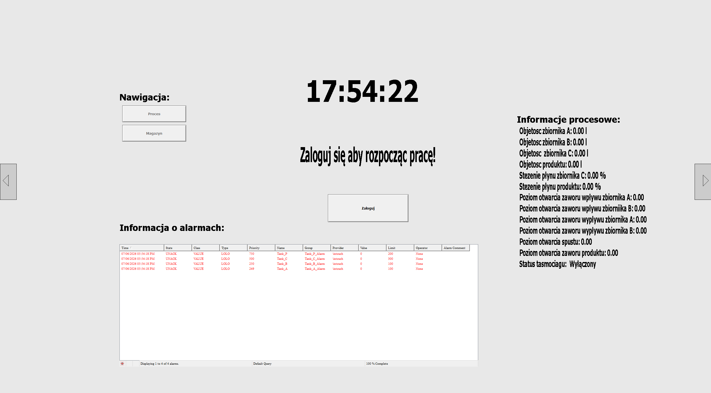
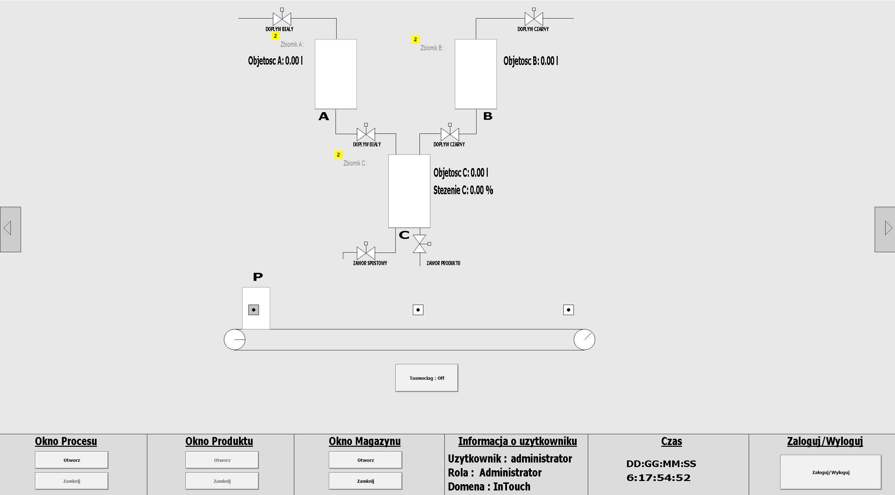
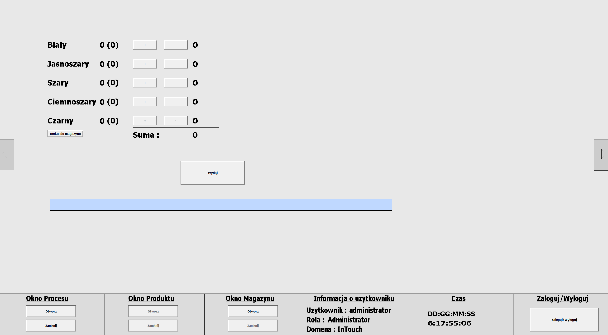
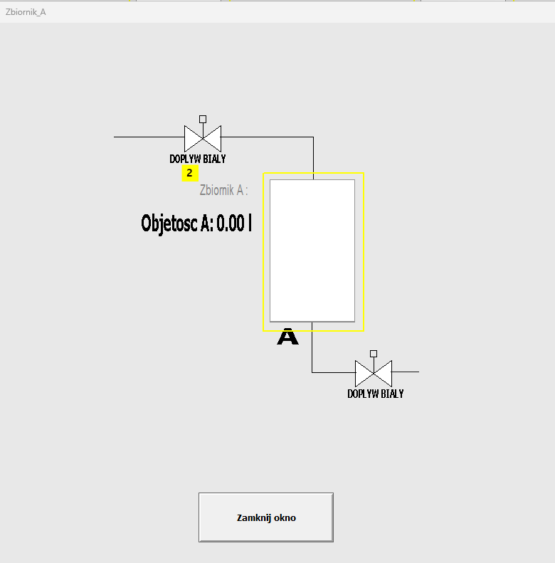
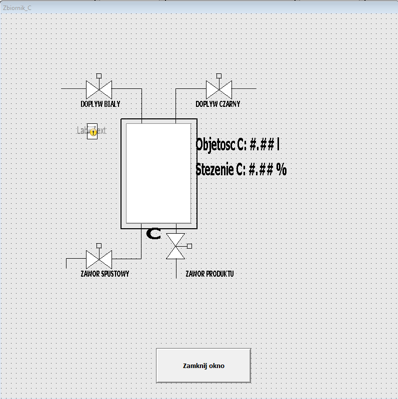
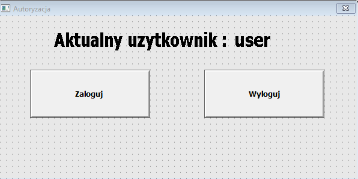

# SCADA Process Simulation – AVEVA InTouch

## Project Overview

This project presents a SCADA/HMI visualization of a three-tank liquid mixing and packaging process developed in AVEVA InTouch.The application simulates liquid storage, mixing, product filling, conveyor operation, and warehouse management while following the principles of Situational Awareness.It includes process monitoring, manual control of technological equipment, alarm management, and role-based user authentication to ensure secure operation. 
The project was created as part of an industrial process visualization and monitoring laboratory.

## Project Objectives

- Design and implement an industrial SCADA/HMI application in AVEVA InTouch.
- Monitor and control a three-tank liquid mixing process.
- Simulate conveyor-based product transportation and filling.
- Implement warehouse management for finished products.
- Configure alarm handling and process monitoring.
- Apply role-based user authentication and access control.
- Follow Situational Awareness principles to improve operator usability.

## Main Features

- Multi-level SCADA/HMI interface designed according to Situational Awareness principles.
- Real-time monitoring of tanks, valves, and process parameters.
- Manual control of liquid flow and mixing process.
- Conveyor belt simulation with automatic product filling.
- Warehouse management with order preparation and inventory control.
- Role-based authentication and access control.
- Process alarm configuration and monitoring.
- Product classification based on liquid concentration.
  
## Technologies

- AVEVA InTouch
- SCADA / HMI
- ArchestrA Graphics
- InTouch Scripting
- Industrial Automation
- Situational Awareness
- Alarm Management
- User Authentication and Access Control
   
## Screenshots

### Main Dashboard

---

### Process Window

---

### Warehouse

---

### Tank A

---

### Tank C

---

### Authorization Window

## Demonstration

A demonstration video will be added soon.

## Future Improvements

Possible future extensions of the project include:

- Integration with a PLC controller.
- Database support for production history.
- MES/ERP integration.
- Advanced process trends and reporting.
- Automatic process control algorithms.
  
## Documentation

The project documentation contains a detailed description of the application, implemented process logic, alarm handling, user management and the overall system functionality.

The complete project report is available in the `docs` directory.

## Skills Demonstrated

This project demonstrates practical knowledge of:

- SCADA application development
- HMI design
- Industrial process visualization
- Process control logic
- Alarm configuration
- User authentication
- Industrial automation
- Human-Machine Interface (HMI)
  
## Author

Yevhenii Barannik

Automation and Robotics

Faculty of Electrical Engineering
